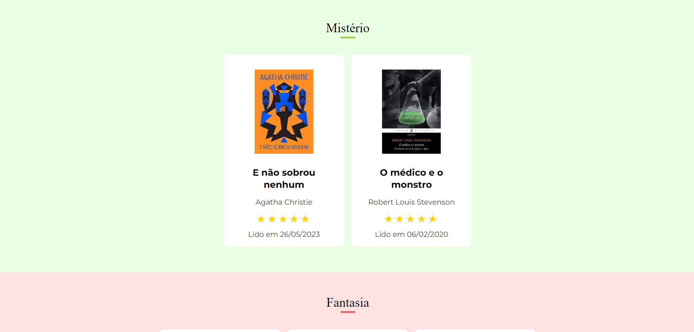
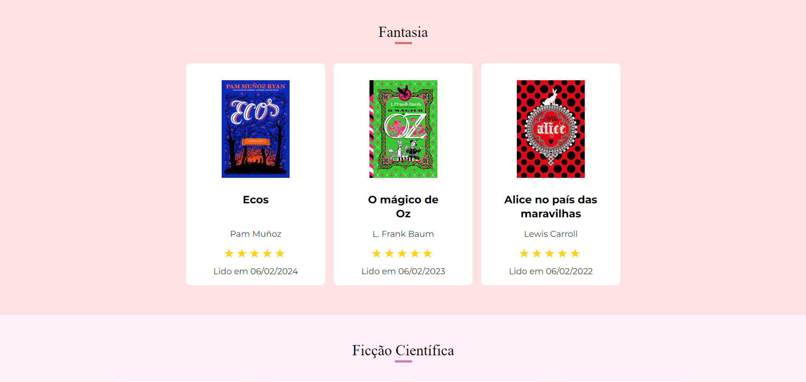
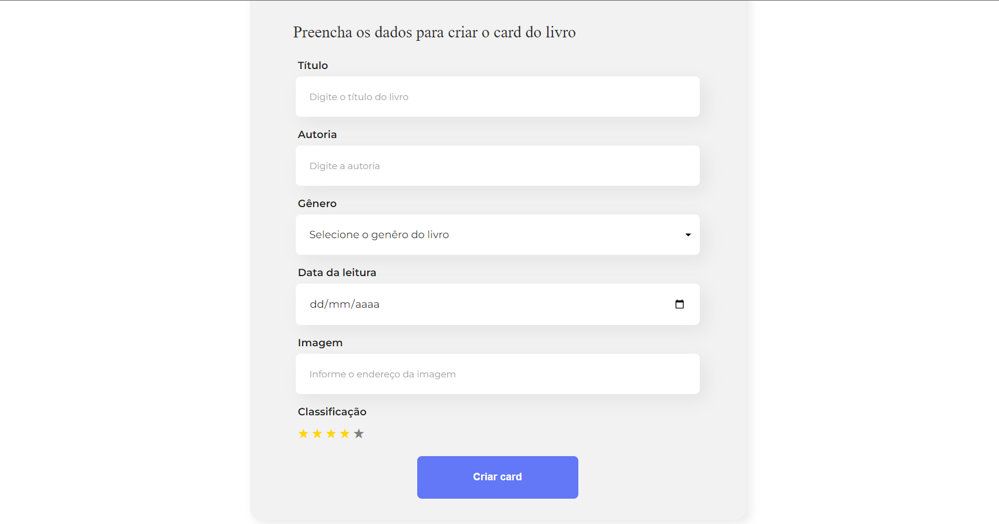
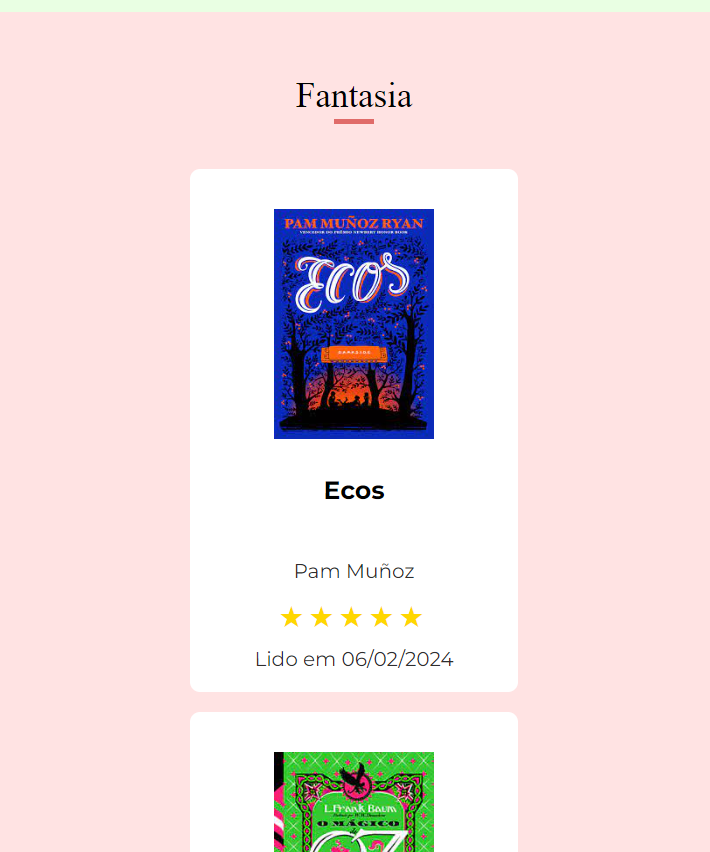
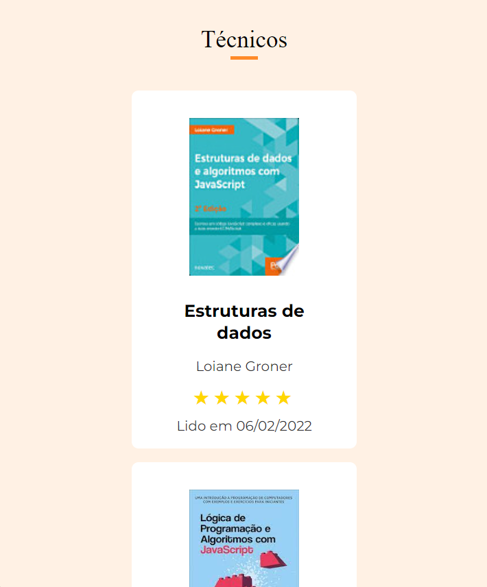
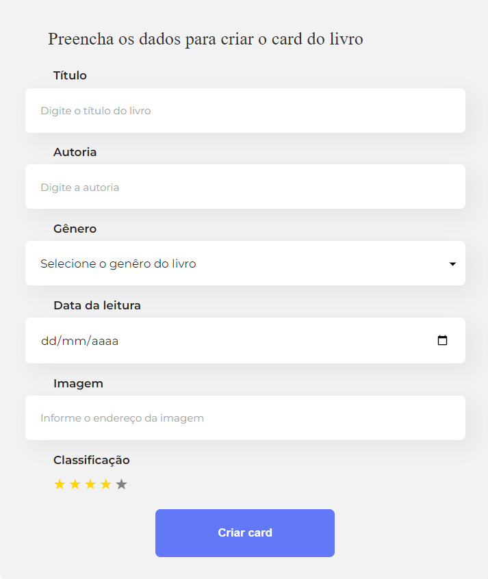

# Organo

O Organo é um aplicativo organizador de leituras que permite cadastrar livros, incluindo informações como título, autoria, imagem, gênero, data da leitura e classificação.

## ✔️ Técnicas e tecnologias utilizadas

`Angular`: Framework utilizado para construir a aplicação, na versão 17.

`Jest`: Estrutura de teste utilizada para realizar testes de unidade.

## 🛠️ Abrir e rodar o projeto

Você vai precisar do NodeJS, versão 18 ou maior.
Após baixar o projeto, você precisa instalar as dependências utilizando o comando:
```bash
npm install
```
Depois, para executar o projeto em modo desenvolvimento:
```bash
ng serve
```
Então, acesse [http://localhost:4200/](url) no seu navegador.














