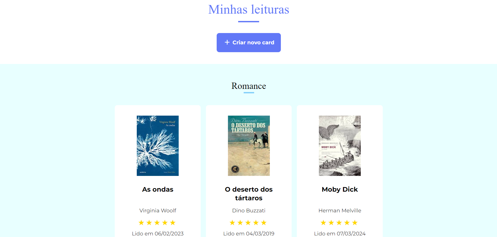
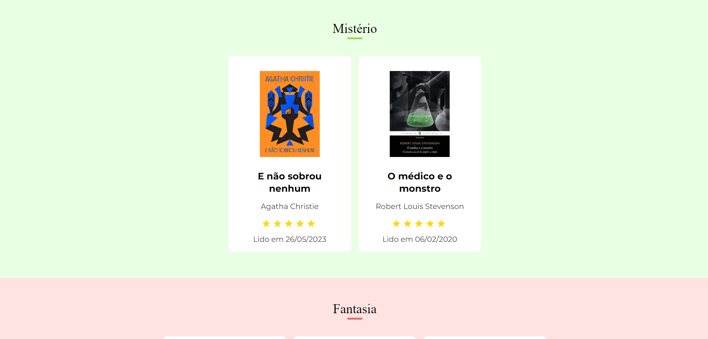
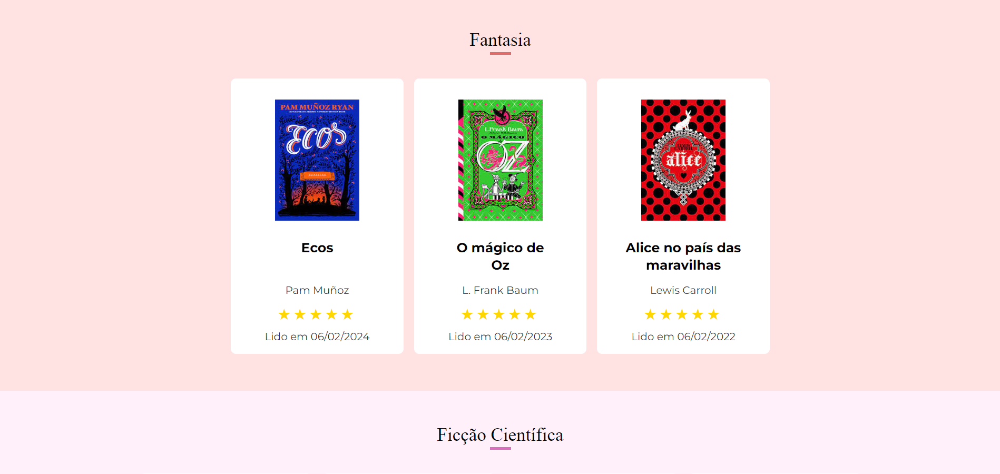
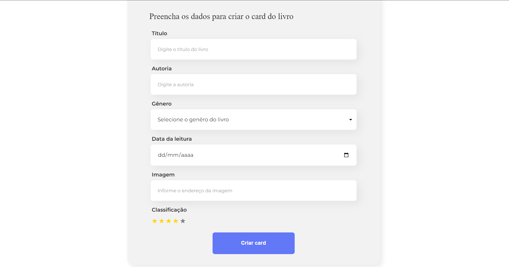
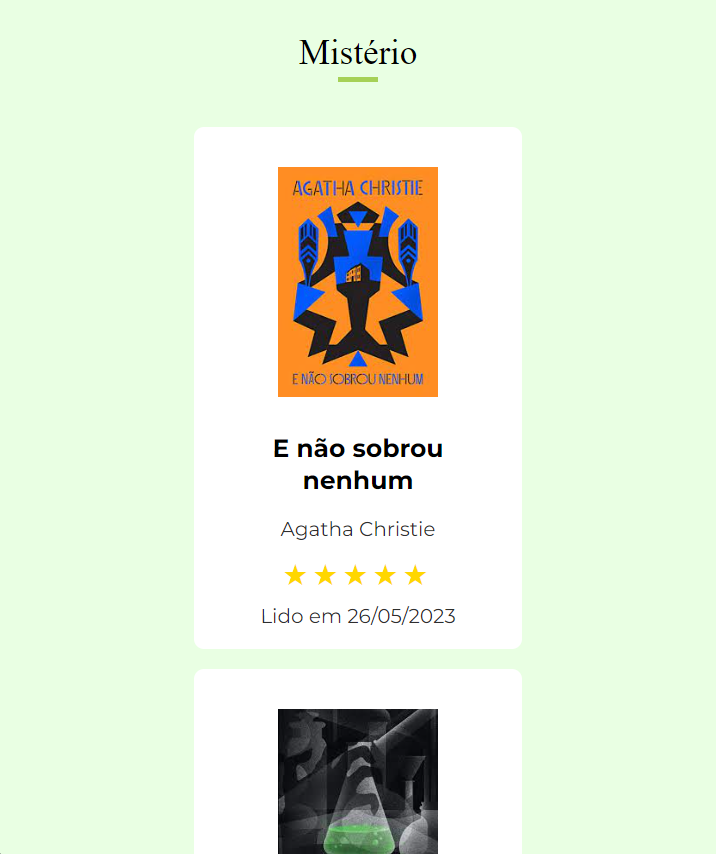
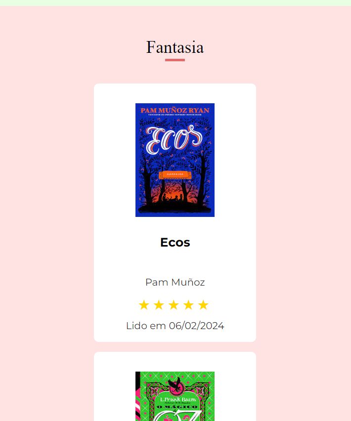
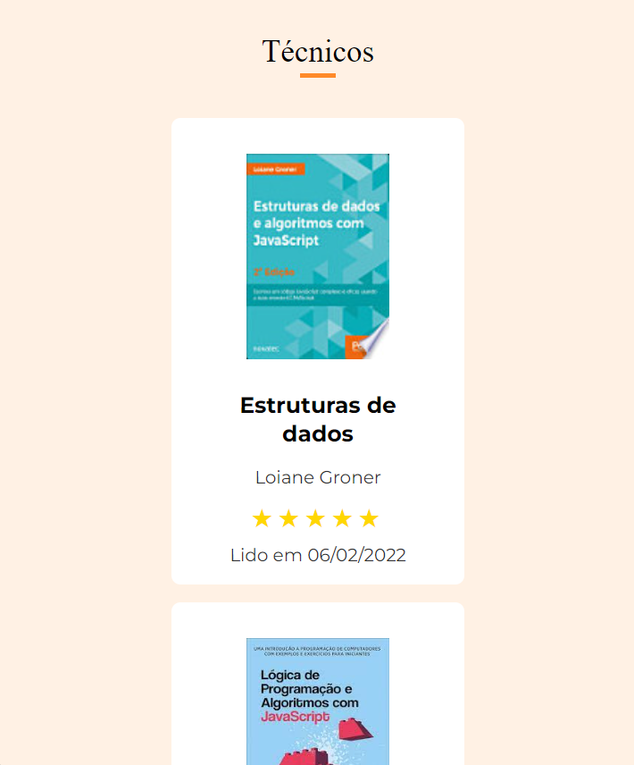
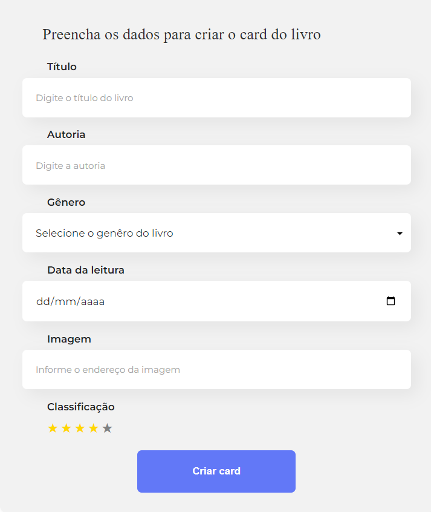

# 📚 Organo - Organizador de Leituras

O **Organo** é um aplicativo construído com Angular para organizar leituras. Ele permite cadastrar livros, incluindo informações como:

- 📖 Título
- ✍️ Autoria
- 🖼️ Imagem da capa
- 🏷️ Gênero
- 📅 Data da leitura
- ⭐ Classificação

---

## ✔️ Técnicas e Tecnologias Utilizadas

- **Angular**: Framework principal da aplicação (`@angular/cli@19.1`)
- **Jest**: Estrutura de testes unitários para Angular

---

## 🛠️ Como Abrir e Rodar o Projeto

1. Certifique-se de ter o **Node.js** versão 18 ou superior.
2. Instale as dependências: npm install
3. Execute o projeto em modo desenvolvimento: ng serve
4. Acesse em seu navegador: http://localhost:4200

---

## 🧪 Rodando os Testes

Para executar os testes com Jest: npm run test

---

## 🌿 Estratégia de Branches

O repositório segue um fluxo simplificado de versionamento:

main: versão estável e pronta para produção

development: branch principal para desenvolvimento ativo

test: branch usada para validar funcionalidades antes de integrar na development

---

## 📷 Demonstração da Aplicação

---
